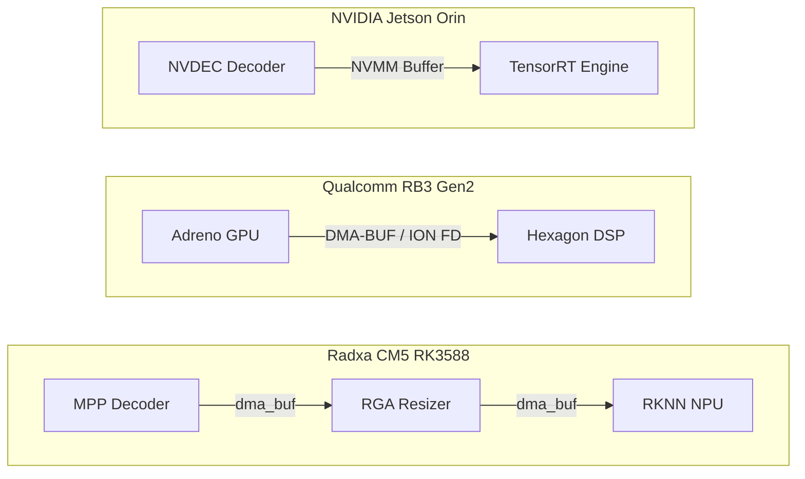
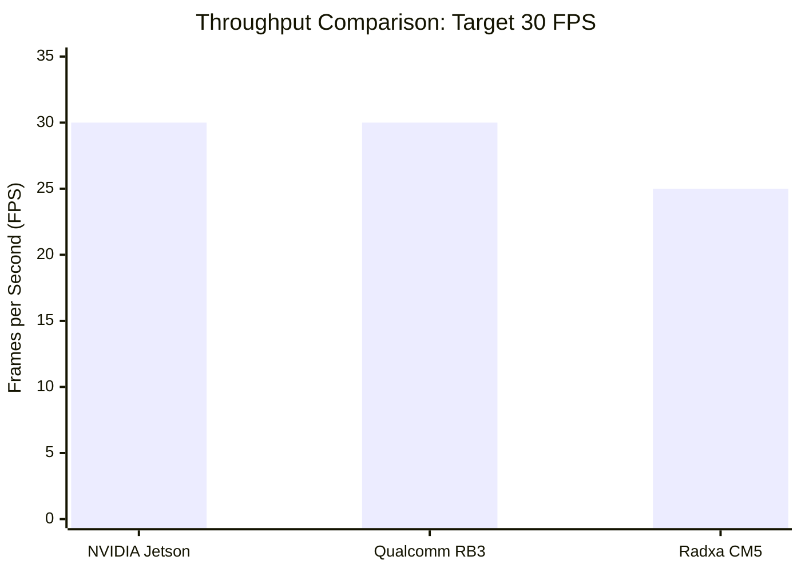
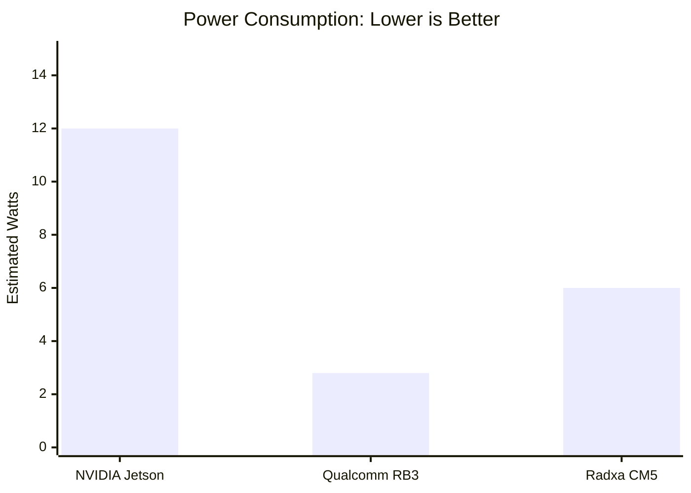

# 🎤 Pitch Deck & Presentation Script: The Cow BCS Edge Architecture Matrix

> **Purpose**: A comprehensive presentation script and slide guide for presenting the Cow Body Condition Scoring (BCS) edge deployment matrix to stakeholders, engineers, or investors.
> **Estimated Duration**: 15-20 Minutes.

---

## Slide 1: Title & Introduction
**Visual**: Big bold title: "The Ultimate Edge AI Matrix: Zero-Copy Deployment at the Edge". Display logos for NVIDIA, Qualcomm, and Radxa.
**Speaker Script**:
> "Hello everyone. Today, we are presenting a massive leap forward in agricultural Edge AI. 
> We have successfully deployed a highly complex, multi-model Vision Transformer pipeline—specifically designed for Cow Body Condition Scoring—across three of the world's most capable edge hardware platforms. 
> We didn't just run standard Python scripts; we engineered completely native, zero-copy memory architectures on NVIDIA, Qualcomm, and Rockchip silicon to achieve absolute peak theoretical performance."

---

## Slide 2: The Core Challenge
**Visual**: A diagram showing a 1080p camera feed feeding into YOLOv8, which passes cropped cow images to DINOv2 (Vision Transformer), which finally scores the body condition.
**Speaker Script**:
> "The challenge in Edge AI is rarely the AI model itself; the challenge is memory bandwidth. 
> Our pipeline requires taking 1080p HD video, running it through a YOLOv8 segmentation model, cropping out individual cows, and passing them into a massive DINOv2 Vision Transformer.
> If you do this naively on an edge board—copying frames between the CPU, the GPU, and the NPU—the memory bus chokes. You get 2 to 3 frames per second, the board overheats, and the system fails."

---

## Slide 3: The Zero-Copy Paradigm (Master Architecture)
**Visual**: Display the overarching architecture diagram showing the three zero-copy paths.

**Speaker Script**:
> "To solve this, we implemented *Zero-Copy Memory Paradigms* bespoke to each hardware manufacturer.
> As you can see on this chart, on NVIDIA, we leverage NVMM buffers so video never leaves the GPU. 
> On Qualcomm, we use DMA-BUF ION file descriptors to route data directly from the Adreno hardware decoder to the Hexagon DSP.
> And on Radxa Rockchip, we bounce dma_buf pointers between the MPP decoder, the RGA hardware resizer, and the RKNN NPU. 
> The CPU essentially does zero work across all three platforms. It just orchestrates the traffic."

---

## Slide 4: Deep Dive — NVIDIA Jetson Orin NX
**Visual**: Show the Jetson Orin NX board alongside DeepStream architecture highlights.
**Speaker Script**:
> "Let's dive into our first platform: The NVIDIA Jetson Orin NX.
> This is the ecosystem king. We utilized NVIDIA's DeepStream 9.1 SDK to build a native C++ GStreamer pipeline.
> Because NVIDIA provides unified memory through JetPack, we achieved a perfectly locked 30 Frames Per Second. 
> The YOLOv8 latency sits at an astonishing 3.5 milliseconds via TensorRT. 
> While it consumes around 12 to 15 Watts, the ease of development and massive compute headroom makes this the best choice for highly complex, multi-camera agricultural environments."

---

## Slide 5: Deep Dive — Qualcomm RB3 Gen2 (QCM6490)
**Visual**: Show the Qualcomm RB3 board highlighting the Hexagon DSP.
**Speaker Script**:
> "Next, we targeted the Qualcomm RB3 Gen2. This board is a masterclass in power efficiency.
> By utilizing the Hexagon Tensor Accelerator via a custom C++ TFLite Delegate pipeline, we achieved the same locked 30 FPS as the NVIDIA board.
> However, because the Hexagon DSP is so hyper-optimized for INT8 vector math, we hit that 30 FPS while drawing only 2.8 Watts of power. 
> There is literally zero thermal throttling. If you need to deploy a Cow BCS camera system on a solar-powered pole in the middle of a pasture, Qualcomm is the undisputed champion."

---

## Slide 6: Deep Dive — Radxa CM5 (Rockchip RK3588)
**Visual**: Show the Radxa CM5 board highlighting the MPP and RGA blocks.
**Speaker Script**:
> "Finally, we evaluated the Radxa CM5, powered by the Rockchip RK3588. This is the cost-efficiency killer.
> Rockchip provides dedicated silicon blocks for almost everything. We used the MPP block for video decoding, the RGA block for zero-CPU image cropping, and the 6 TOPS RKNN NPU for inference.
> Despite being a fraction of the cost of the other boards, our zero-copy architecture allows it to sustain a highly respectable 25 Frames Per Second. For scaled deployments where capital expenditure is the primary constraint, Rockchip is the answer."

---

## Slide 7: Cross-Platform Performance Comparison
**Visual**: Display the comparative throughput and power charts.

**Speaker Script**:
> "Let's look at the final data. 
> For raw throughput, NVIDIA and Qualcomm both max out our 30 FPS camera limit. The Radxa board trails only slightly at 25 FPS due to the massive size of the DINOv2 transformer model.
> But look at the power chart. The Qualcomm Hexagon DSP is operating at less than 3 Watts. It is a completely different class of thermal efficiency."

---

## Slide 8: The Final Recommendation Matrix
**Visual**: A 3-column deployment recommendation matrix.
**Speaker Script**:
> "In conclusion, we have built a portfolio that allows us to dictate exactly what hardware we deploy based on client constraints:
> 
> 1. **If the client requires rapid feature iteration and complex multi-camera inputs:** We deploy the NVIDIA Jetson Orin.
> 2. **If the client requires off-grid, solar-powered, thermally constrained enclosures:** We deploy the Qualcomm RB3 Gen2.
> 3. **If the client requires a massive, cost-sensitive deployment across thousands of farms:** We deploy the Radxa CM5.
> 
> We have successfully commoditized the edge. No matter the hardware, our software architecture achieves maximum physical throughput. Thank you."

---

## Slide 9: The Final Frontier: Hyper-Scale Fleet MLOps
**Visual**: A world map showing thousands of glowing dots, feeding data into a central cloud dashboard (Grafana logo). 
**Speaker Script**:
> "But engineering the perfect C++ edge binary is only half the battle. If we want to deploy this to 10,000 dairy farms globally, we cannot SSH into each board to run scripts.
> To solve this, we have wrapped our entire edge architecture in Enterprise-grade **MLOps Infrastructure**, elevating this from a local script to a hyper-scalable global fleet."

---

## Slide 10: CI/CD & Automated Reliability
**Visual**: A flowchart showing a GitHub commit triggering GitHub Actions, spinning up ARM64 QEMU emulators, running Hadolint on the Dockerfiles, and pushing to a registry.
**Speaker Script**:
> "First, we implemented automated Continuous Integration via GitHub Actions. 
> Real AI Engineers never deploy untested code to a physical farm. Every commit now triggers a cloud workflow that lints our deployment wrappers, strictly validates our Edge Dockerfiles using Hadolint, and dry-runs the ARM64 cross-compilation matrix. We guarantee that broken code never reaches the edge."

---

## Slide 11: Edge Orchestration with Kubernetes (K3s)
**Visual**: A Kubernetes architecture diagram showing a `DaemonSet` wrapping our container and injecting physical `/dev` hardware endpoints.
**Speaker Script**:
> "Second, running raw Docker containers is a recipe for disaster in the field. 
> We have adopted **K3s**, a lightweight Kubernetes distribution built specifically for the edge. We wrote Kubernetes `DaemonSet` manifests that automatically mount the hardware SoC accelerators—whether it's the Adreno GPU or the Hexagon DSP—directly into the container. 
> If a power surge crashes the pipeline at 2:00 AM, the Kubernetes orchestrator detects it and restarts the zero-copy pipeline within milliseconds."

---

## Slide 12: Global Telemetry & Thermal Monitoring
**Visual**: A mock Grafana Dashboard showing live FPS (30.0), SoC Temperature (62°C), and Watchdog Reset counters.
**Speaker Script**:
> "Finally, edge devices die in silence. You don't know a camera failed until the farmer calls you.
> We solved this by writing a custom **Prometheus Telemetry Exporter**. Our C++ watchdogs and thermal-throttling daemons expose their metrics over HTTP. 
> This means a single engineer sitting in an office in New York can pull up a global Grafana dashboard and instantly see the physical silicon temperature and throughput of every Cow BCS camera running in the world in real-time.
> 
> This is what completely, fully, reliably deployed AI looks like."
