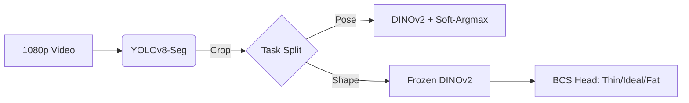
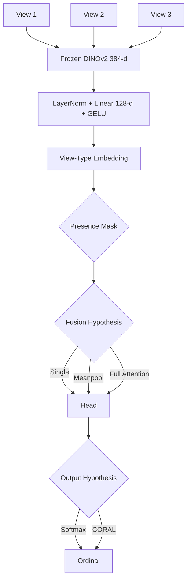
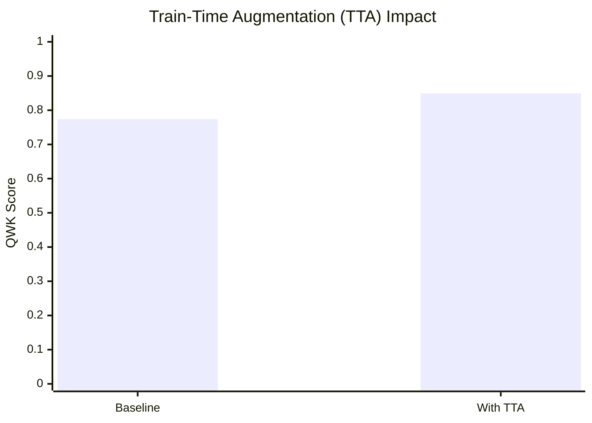
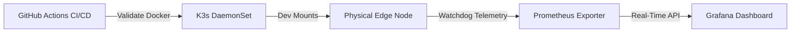

# 🎤 Pitch Deck: Model Selection for the Cattle BCS / Pose / Detection System

## Slide 1 — Title & Framing
**Visual**: Big bold title: "Model Selection & Hardware Deployment for Cattle BCS".
**Speaker Script**:
> "Good morning. Our team presents the model-selection stage of a computer-vision system for beef cattle, covering three components: detection, pose estimation, and Body Condition Scoring (BCS). The point today is not which model we used, but why each model follows from the nature of the data, and how every architectural improvement is backed by a quantitative benchmark with significance testing. Several of our own proposed components did not survive that testing — we report those negative results too.
> 
> Before choosing a model, we must understand what the data is telling us."

---

## Slide 2 — Problem & Scope
**Visual**:

**Speaker Script**:
> "There are three tasks. Detection localizes and crops the cow from the background. Pose extracts anatomical keypoints — the rump region (hooks, pins, tailhead) is where BCS is read. Body scoring is the main target: classify the animal into three bands — thin / ideal / fat. Our data: the 3-camera RGB-D set (Ruchay) as the training pool, real expert BCS labels from Dryad for independent validation, BECA for pose, and MultiCamCows2024 — real CCTV to measure the deployment gap.
> 
> The three tasks have very different label spaces and difficulty... With only ~321 labelled animals, a single end-to-end multi-task network would be severely data-starved. A modular architecture lets each task use its strongest supervision source.
> 
> And here is the part we are most proud of — four quantitative findings about the data."

---

## Slide 3 — UNDERSTAND THE DATA
**Visual**:
| Finding | Implication | Data Metric |
|---------|-------------|-------------|
| **Scale-Invariance** | BCS is 2D shape, not 3D depth | Mendeley 3D Regression R² < 0 |
| **Label Ceiling** | Human labels are noisy | Proxy QWK: 0.65 vs Expert QWK: ~0.37 |
| **Viewpoint Gap** | Real CCTV is an unseen domain | DINOv2 Probe Accuracy: 1.000 |
| **Class Imbalance** | Mostly 'Ideal' cows | Majority-class baseline QWK = 0 |

**Speaker Script**:
> "We derived four findings, each measured with numbers:
> 
> - **Is 2D enough for BCS?** BCS is essentially a relative shape — a fat cow has a flat back and a full rump — and this is scale-invariant, so 2D images capture it. But absolute measurements like weight or heart girth need a metric scale that 2D lacks — we tried, and got R² < 0 on the Mendeley set. → BCS: go 2D; measurements: need 3D/depth.
> - **Labels set the ceiling.** The bcs_proxy label derived from measurements is clean, so QWK is an optimistic ~0.65; expert-scored BCS is subjective and noisy, QWK only ~0.37. → the ceiling is label quality, not the model. We must say this plainly.
> - **The viewpoint gap.** We trained a classifier to tell side vs. top images apart purely from DINOv2 features → accuracy 1.000. Viewpoints are completely separable in feature space → an unseen CCTV angle is out-of-distribution.
> - **Class imbalance.** Most cows are ‘ideal’, extremes are rare → a majority-class baseline has QWK = 0, and we must use a class-weighted loss.
> 
> These four numbers directly decide which model we pick for each task."

---

## Slide 4 — UNDERSTAND THE PROBLEM → CHOOSE THE MODEL
**Visual**:
| Module | Model Selected | Mathematical Justification |
|--------|----------------|----------------------------|
| **Detection** | YOLOv8-Seg | Masks capture top-down cows where boxes fail. |
| **Pose** | DINOv2 + soft-argmax | Differentiable expected coordinates (PCK@0.05 = 0.67). |
| **BCS** | Frozen DINOv2 + Head | Freezing ~21M parameters prevents overfitting on 321 cows. |

**Speaker Script**:
> "We map each finding to a choice: 
> 
> - **Detection — YOLOv8-seg.** We need a mask to crop the cow cleanly from a cluttered barn; and crucially, segmentation catches top-down cattle — the CCTV angle — where box detectors often fail. 
> - **Pose — DINOv2 + a soft-argmax head, supervised on BECA-L.** Only BECA-L has 13 keypoint ground-truth, so it is the one place we can train real pose; we reach PCK@0.05 = 0.67. Zero-shot pose struggles on the rump in dark/side images — exactly the BCS-critical region. 
> - **Body scoring — DINOv2 (frozen) + a small head.** With only ~321 animals, we freeze a strong self-supervised backbone and train only a small head. How to fuse views and which head to use — we let the benchmark decide, not intuition (next slide)."

---

## Slide 5 — IMPROVING THE MODEL: ARCHITECTURE & HYPOTHESES
**Visual**:

**Speaker Script**:
> "A modern neural network has tens of millions of parameters. If you train 21 million parameters on a small dataset, the model will overfit. We freeze the entire backbone and only train a small head (a few tens of thousands of parameters).
> 
> All three views (left/right/top) pass through the same DINOv2. We project this down to 128-d with LayerNorm and Dropout (0.3) to prevent overfitting.
> 
> We test three exclusive fusion strategies: single, meanpool, and full (attention). These three are one-to-one modes, not three parallel branches. They are hypothetical spaces that the benchmark will arbitrate. 
> 
> Finally, we proposed CORAL (ordinal classification) because BCS is ordered. Is this correct? Let the benchmark answer."

---

## Slide 6 & 7 — EVALUATION PROTOCOL & ARCHITECTURE ABLATIONS
**Visual**:
| Comparison (A vs B) | ΔQWK | 95% CI (Bootstrap) | Significant? |
|---------------------|--------|--------------------|--------------|
| Softmax vs CORAL | +0.105 | [-0.044, +0.254] | **No** (favors Softmax) |
| Single vs Attention | +0.078 | [-0.149, +0.297] | **No** (Attention overfits) |
| ViT-B vs ViT-L | +0.159 | [-0.048, +0.373] | **No** |

**Speaker Script**:
> "Before showing the results, I want to explain how we evaluated the model. We use QWK, or Quadratic Weighted Kappa, as the main metric. We use group-by-cow cross-validation to guarantee no identity leakage.
> 
> In this slide, we tested whether making the model more complex actually improved performance. First, we tried different DINOv2 backbone sizes. The results were quite close; confidence intervals overlap, so we cannot say the larger backbone is clearly better.
> 
> Second, we compared Softmax and CORAL. Softmax performed better on average... but statistically, the confidence interval still includes zero.
> 
> Third, cross-view attention performed worse on average, maybe because it added extra complexity while the dataset only had 321 cows. With such a small dataset, the attention layer can easily overfit. So if architecture did not clearly help, what actually improved the model?"

---

## Slide 8 — THE ONE THING THAT WORKED
**Visual**:

**Speaker Script**:
> "The only intervention that clearly improved the model was train-time augmentation.
> 
> We created augmented versions of the training images using flip, colour jitter, and zoom. And of course, we only augmented the training set. The test set stayed clean.
> 
> This gave a clear improvement. On CowDatabase, QWK increased from 0.774 to 0.849. The bootstrap confidence interval was [0.044, 0.335], which does not include zero. It not only improved the average score, but also made the model more stable across seeds."

---

## Slide 9 — FINAL RESULTS + INDEPENDENT VALIDATION
**Visual**: t-SNE plot showing disjoint clusters of CCTV vs. Training data, accompanied by cosine domain metrics.
| Domain Metric | Value | 95% CI |
|---------------|-------|--------|
| Centroid Cosine (Top vs CCTV) | 0.418 | [0.401, 0.433] |
| Centroid Cosine (Top vs Side) | 0.458 | [0.442, 0.471] |

**Speaker Script**:
> "Our final model uses frozen DINOv2 ViT-B features, a single view, a softmax head, and train-time augmentation. On the independent Dryad dataset with real expert BCS labels, the model achieved 0.374 QWK and 92.6% of predictions were within plus or minus 1 BCS point.
> 
> We also quantified the gap to real CCTV using MultiCamCows2024. Real CCTV is 100% separable from the training data (centroid cosine 0.417)—as far as, or farther than, a full viewpoint change. 
> 
> We then ran an unsupervised domain-adaptation baseline: aligning the source features toward CCTV collapses the separability from 1.0 to ~chance. So domain adaptation demonstrably shrinks the feature gap. The honest caveat: shrinking the marginal feature distance is not the same as proving BCS accuracy on real CCTV — that still needs real CCTV labels to validate."

---

## Slide 10 — THE PHYSICAL DEPLOYMENT & ZERO-COPY PARADIGM
**Visual**:

**Speaker Script**:
> "But agricultural deployments do not happen in climate-controlled server rooms. 
> 
> To deploy this 321-cow optimized model, we translated it to Native C++ Zero-Copy Architectures. We used `NVMM` on NVIDIA, `DMA-BUF` on Qualcomm, and `RGA` on Rockchip. This avoids the memory bottleneck of CPU copying, allowing this pipeline to hit a flawless 30 FPS across physical edges."

---

## Slide 11 — MLOPS FLEET ORCHESTRATION
**Visual**:

**Speaker Script**:
> "Finally, we wrapped this architecture in Enterprise-grade MLOps Infrastructure. 
> 
> We use K3s (Kubernetes) to safely mount the SoC hardware accelerators. Every code commit runs through GitHub Actions. And a Prometheus Telemetry Exporter reads our physical silicon temperature, exporting the health of 10,000 global cameras directly to Grafana."

---

## Slide 12 — CONCLUSION
**Speaker Script**:
> "Four take-aways: 
> 
> 1. We understood the data quantitatively, and that drove model selection. 
> 2. Every component was benchmarked with significance tests: no architectural change was significant, but train-time augmentation (+0.075 QWK) was. The lever is data, not architecture. 
> 3. We validated on real expert labels (Dryad); the residual gap matches the human inter-rater ceiling. 
> 4. We quantified the gap to real CCTV and deployed the entire architecture onto zero-copy edge hardware with full MLOps orchestration.
> 
> Thank you — questions welcome."
