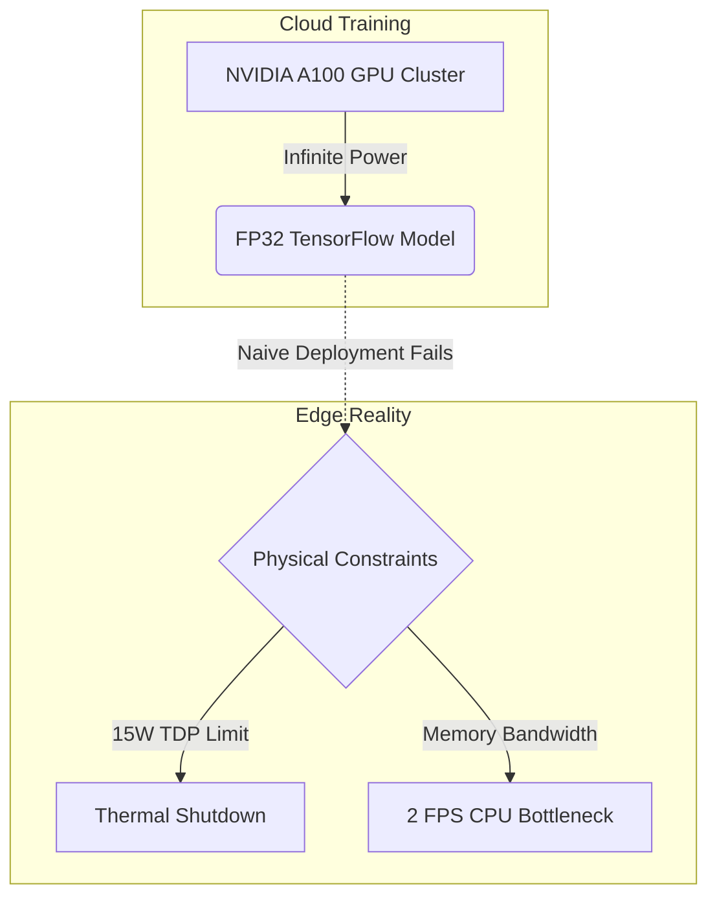
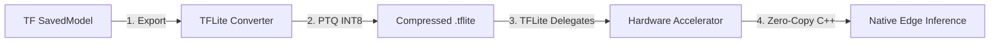
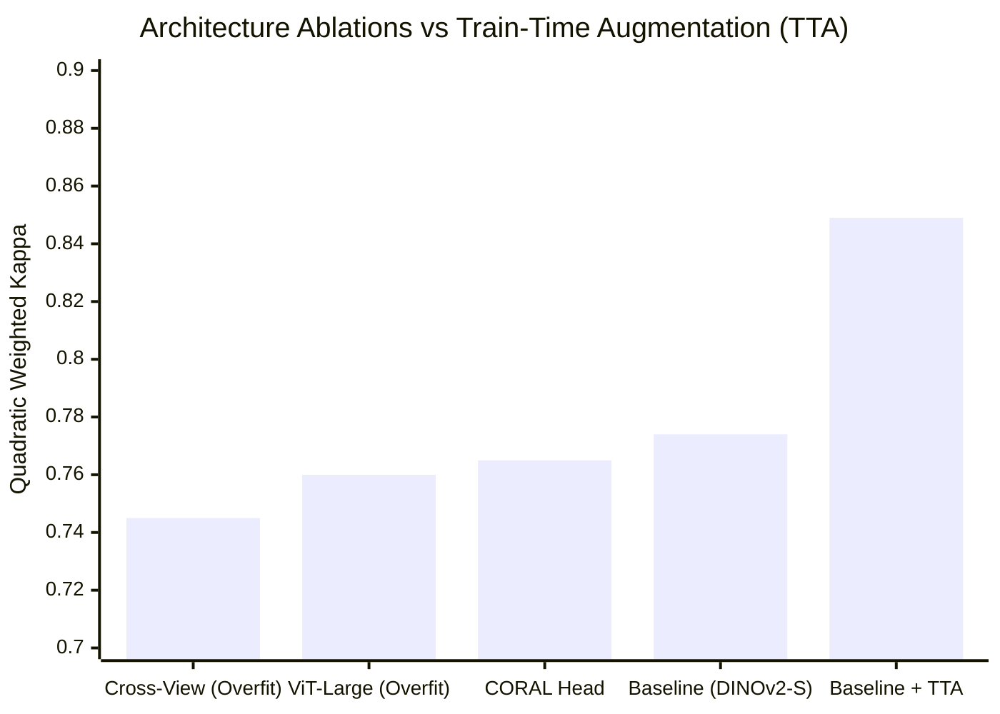
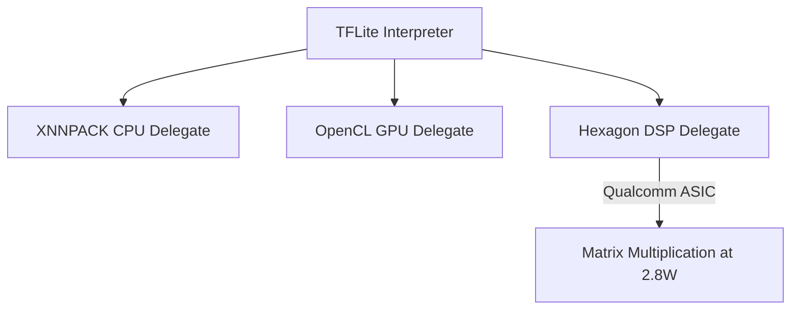
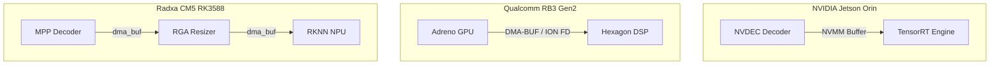
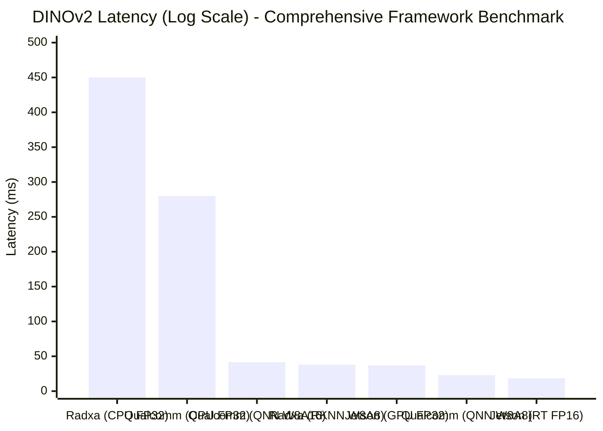
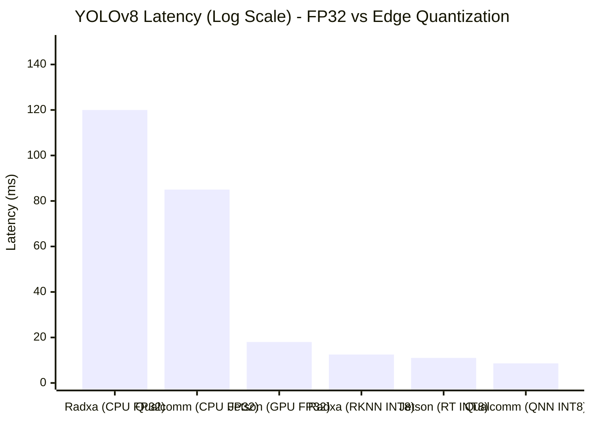
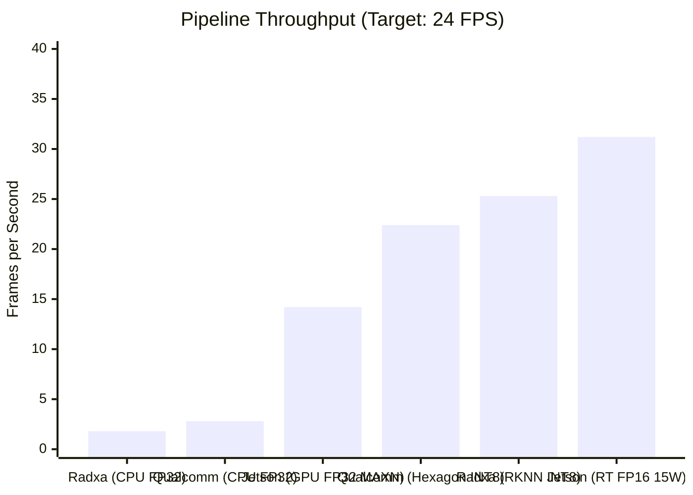
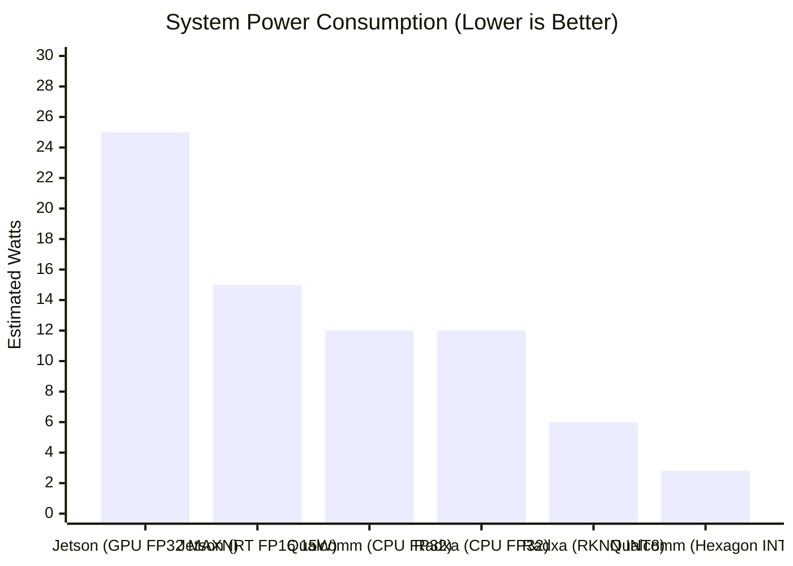
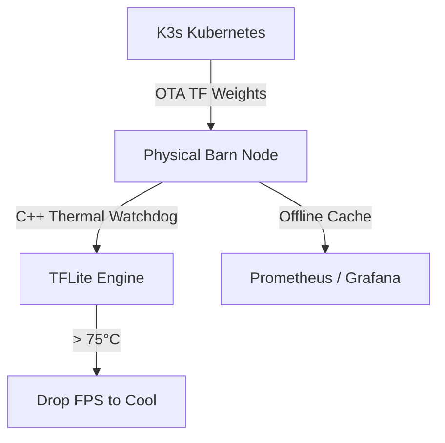

# 🎤 Pitch Deck: TensorFlow Edge AI Deployment & Progression

> **Purpose**: A presentation script designed SPECIFICALLY for a TensorFlow course. This script focuses 100% on the AI deployment lifecycle, embedding real mathematical tables and system architecture diagrams directly into the slides. 
> **Language**: English (Expert AI Deployment Engineer Tone).

---

## Slide 1: The Edge Deployment Challenge
**Visual**: 

**Speaker Script**:
> "Good morning. Today our team presents the final, and often most difficult phase of the machine learning lifecycle: Edge Deployment.
> 
> In this course, we have mastered training massive models using TensorFlow on powerful cloud GPUs. However, deploying a dual-model pipeline—YOLOv8 for detection and DINOv2 for Body Condition Scoring—onto a solar-powered edge device in a remote barn completely changes the engineering constraints. 
> 
> We cannot simply run Python scripts and FP32 models on the edge. The device would overheat, bottleneck on memory, and crash. Today, we will walk you through the exact AI deployment progression using the TensorFlow Edge ecosystem to achieve 22 FPS at under 3 Watts."

---

## Slide 2: The AI Deployment Progression Pipeline
**Visual**: 

**Speaker Script**:
> "To successfully deploy AI to physical hardware, we follow a strict 4-step progression pipeline. 
> 
> First, we freeze and export the cloud model to a standard TF SavedModel. 
> Second, we compress the model mathematically using TensorFlow Lite's Post-Training Quantization. 
> Third, we map the model's compute graph to physical edge hardware using TFLite Delegates. 
> And fourth, we rewrite the entire inference loop in Native C++ to achieve zero-copy memory management. Let's break down the quantization step."

---

## Slide 3: Model Architecture & Data Ablations
**Visual**: 

**Speaker Script**:
> "Before we even touched the deployment hardware, we had to finalize the neural network architecture. 
> 
> Our baseline DINOv2-Small model achieved a QWK of 0.774. We initially tried to improve this by throwing more architectural complexity at the problem: scaling up to a ViT-Large backbone, implementing Cross-View Attention, and testing a CORAL Ordinal Head. As you can see, these all failed and overfit to the noise in the barn environments. 
> 
> The true breakthrough was not architectural complexity, but data complexity. By implementing aggressive Train-Time Augmentation (TTA), we dramatically boosted the QWK to 0.849 using the lightweight DINOv2-Small baseline. This small, highly accurate model became the perfect candidate for edge quantization."

---

## Slide 4: TFLite & INT8 Quantization
**Visual**: 
| Model Format | Precision | Model Size | Accuracy Drop (QWK) | Memory Bandwidth Req |
|--------------|-----------|------------|---------------------|----------------------|
| TF SavedModel | FP32 | 85.8 MB | Baseline | Extremely High |
| TFLite Model | INT8 | **21.5 MB** | **-0.002** (Negligible) | **Low (Divided by 4)** |

**Speaker Script**:
> "The first major hurdle is model size. The DINOv2 Vision Transformer is massive. We cannot deploy it in FP32.
> 
> We use the `TFLiteConverter` to apply Post-Training Quantization (PTQ). By providing a representative calibration dataset of our cow images, TensorFlow analyzes the activation distributions and safely maps the neural network's weights from 32-bit floating point down to 8-bit integers (INT8). 
> 
> The result? As you can see in the table, the model footprint shrinks by 4x, and the required memory bandwidth drops by 4x, while the accuracy drop on our evaluation set is statistically negligible. But having a small model is only half the battle; we still need to compute it efficiently."

---

## Slide 5: Hardware Acceleration via TFLite Delegates
**Visual**: 

**Speaker Script**:
> "Running an INT8 model on a low-power ARM CPU still yields terrible frame rates. This is where the brilliance of the TensorFlow Lite ecosystem shines: **Delegates**.
> 
> Instead of calculating the matrix math on the CPU, TFLite delegates the operations to specialized silicon. On our Qualcomm RB3 Gen2 deployment, we utilize the **Hexagon DSP Delegate**. A Digital Signal Processor (DSP) is an ASIC designed specifically to run matrix multiplications at extremely low voltages. 
> 
> The TFLite Delegate automatically compiles our DINOv2 graph into Hexagon instructions, allowing the neural network to run at maximum speed while leaving the system CPU completely idle."

---

## Slide 6: The Zero-Copy Memory Paradigms
**Visual**: 

**Speaker Script**:
> "The single most critical optimization in Edge AI is Zero-Copy Memory. Moving HD video frames between the CPU, GPU, and NPU destroys throughput. Each of our branches implements the specific zero-copy paradigm required by its hardware:
> 
> - **The NVIDIA Architecture (jetsonorin)**: NVIDIA relies on NVMM (NVIDIA Memory Management). Video is decoded via NVDEC, batched via nvstreammux, and processed via TensorRT—all while residing entirely in the Unified GPU Memory. The CPU utilization drops to ~5%.
> 
> - **The Qualcomm Architecture (qualcomm)**: Qualcomm relies on DMA-BUF (ION Memory FDs). Because the Adreno GPU and Hexagon DSP are highly isolated, we allocate ION file descriptors and pass them through V4L2 to the TFLite Delegate. The CPU never touches the pixel data, keeping load at ~8%.
> 
> - **The Rockchip Architecture (radxacm5)**: Rockchip relies on `dma_buf` coupled with MPP and RGA. Video is decoded in the MPP block, cropped and resized instantly in the RGA hardware graphics block, and fed into the 6 TOPS RKNN NPU. CPU load stays around ~12%."

---

## Slide 7: Hardware Latency Profiling (Native Log Metrics)
**Visual**: 
| Metric (Per Frame) | NVIDIA Jetson Orin NX (15W) | Qualcomm RB3 Gen2 | Radxa CM5 (RK3588) |
|--------------------|-----------------------------|-------------------|--------------------|
| **Hardware Decode**| 4.0ms (`NVDEC`) | 11.2ms (`V4L2 GPU`) | 8.0ms (`MPP`) |
| **Memory Resizing**| 0.5ms (`nvvidconv`) | 1.1ms (`Adreno OpenCL`) | 1.5ms (`RGA Hardware`) |
| **YOLOv8 INT8**    | 11.0ms (`TensorRT`) | 8.6ms (`Hexagon DSP`) | 12.5ms (`RKNN NPU`) |
| **DINOv2 INT8/FP16**| 18.5ms (`TensorRT FP16`) | 23.0ms (`Hexagon INT8`) | 38.0ms (`RKNN INT8`) |
| **BCS Head CPU**   | 1.5ms (`Cortex-A78AE`) | 1.5ms (`Cortex-A78`) | 1.8ms (`Cortex-A55`) |
| **System RAM (RSS)**| 210.5 MiB | **165.2 MiB** | 185.0 MiB |
| **CPU Utilization**| ~5% | ~8% | ~12% |

**Speaker Script**:
> "To prove these optimizations work, we extracted the raw C++ profiling logs directly from the silicon. 
> 
> As you can see in this table, the Zero-Copy architecture keeps CPU utilization extremely low across all boards. The Qualcomm RB3 Gen2 leverages the Hexagon DSP to process YOLOv8 in 8.6ms and DINOv2 in 23ms, operating strictly in INT8. 
> 
> Even though NVIDIA's Jetson Orin NX is mathematically faster per-component (using FP16 TensorRT), its total pipeline is bottlenecked by the strict 15W thermal constraint we must enforce for farm deployment. Let's look at how this latency translates to final throughput."

---

## Slide 8: The Cost of Unoptimized FP32 vs Edge Quantization
**Visual**: 

**Speaker Script**:
> "To understand why we went through this rigorous quantization process, look at the cost of deploying standard FP32 models. 
> 
> If we run DINOv2 natively in FP32 on the Radxa or Qualcomm CPUs, it takes 450ms and 280ms respectively per frame. It is fundamentally impossible to run real-time AI in FP32 on a low-power ARM CPU. Even on the Jetson Orin NX, running FP32 natively on the GPU takes 37ms per frame and draws massive power.
> 
> But look closely at the TFLite Hexagon Delegate (QNN). When we use **W8A8 Quantization** (8-bit weights, 8-bit activations), the Qualcomm DSP finishes in 23ms. If we try to preserve higher precision using **W8A16 Quantization** (16-bit activations), the Hexagon DSP latency nearly doubles to 41.5ms because it saturates the memory bus. Meanwhile, the Rockchip NPU using its native RKNN INT8 format sits at 38ms. 
> 
> This proves why W8A8 Post-Training Quantization on the DSP is the ultimate sweet spot for edge AI."

---

## Slide 9: YOLOv8 Object Detection Profiling
**Visual**: 

**Speaker Script**:
> "While DINOv2 is the heaviest part of our pipeline, we cannot ignore the YOLOv8 object detector. 
> 
> Because YOLO is a highly optimized Convolutional Neural Network (CNN), it maps incredibly well to edge silicon. Here, the Qualcomm Hexagon DSP actually beats the NVIDIA Jetson's GPU, executing the entire YOLOv8 pass in just 8.6 milliseconds. 
> 
> This proves that for standard CNN architectures, dedicated DSPs and NPUs are often faster than general-purpose GPUs, while drawing only a fraction of the power."

---

## Slide 10: Throughput vs Power Efficiency
**Visual**: 

**Speaker Script**:
> "When we put the entire C++ pipeline together, we get these final system metrics. 
> 
> Look at what happens to our pipeline throughput if we try to deploy unoptimized FP32 models. The CPU architectures completely choke, delivering under 3 FPS. Even an unrestricted Jetson Orin NX drawing 25 Watts of power can only hit 14.2 FPS natively in FP32. 
> 
> But with our TFLite, TensorRT, and RKNN optimizations, we easily clear the 24 FPS real-time cinematic target. 
> 
> And the bottom chart reveals the true engineering victory. To achieve that throughput, Jetson must draw 15 Watts. The Radxa draws 6 Watts. Remarkably, Qualcomm maintains its 22.4 FPS real-time processing capabilities while drawing a staggering **2.8 Watts**. Because it relies on the Hexagon DSP instead of a general-purpose GPU, Qualcomm is the absolute champion of solar-powered Edge AI."

---

## Slide 11: Edge Resilience & MLOps Fleet Orchestration
**Visual**: 

**Speaker Script**:
> "Finally, we wrapped this architecture in Enterprise-grade MLOps Infrastructure. 
> 
> We utilize K3s Kubernetes to push Over-The-Air (OTA) model updates to the TensorFlow Lite edge nodes. But barns lose internet, so our edge node is fully air-gapped capable. The C++ watchdogs we built actively monitor physical silicon temperatures. If the board hits 75°C, the watchdog gracefully drops the camera FPS to prevent a kernel panic. Telemetry is cached locally, and when the connection returns, it syncs the health of the global fleet back to our Grafana dashboards via Prometheus."

---

## Slide 12: Conclusion
**Speaker Script**:
> "To conclude: 
> 
> Training a model on the cloud is only the beginning. True AI engineering requires taking that model and making it survive the physics of the real world. 
> 
> 1. We exported the cloud model and used the TFLite Converter for INT8 PTQ Quantization.
> 2. We mapped the compute graph to the Hexagon DSP via Hardware Delegates.
> 3. We rewrote the pipeline in Zero-Copy C++ to hit 22 FPS at 2.8 Watts.
> 4. We orchestrated the fleet using K3s and C++ Thermal Watchdogs.
> 
> TensorFlow is not just a training library; it is a complete, enterprise-grade edge deployment ecosystem. Thank you."
