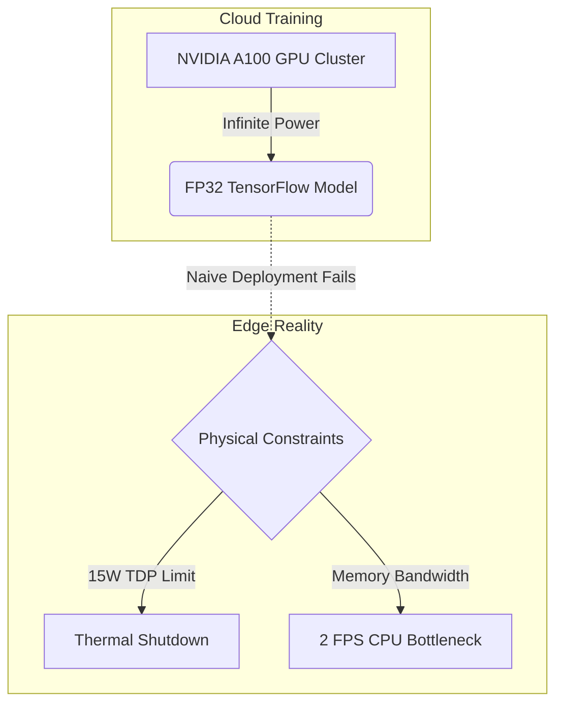
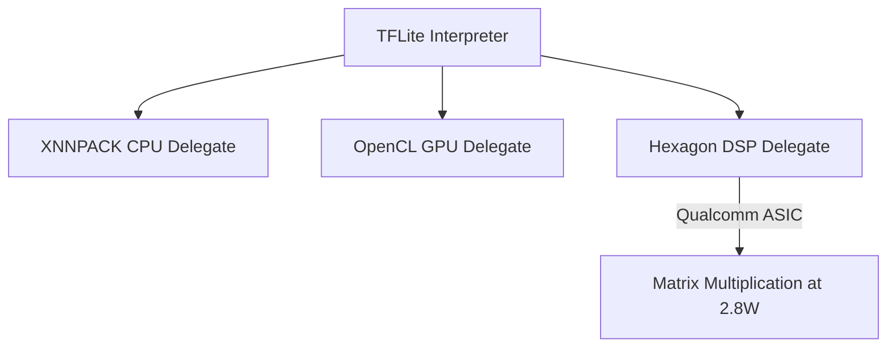
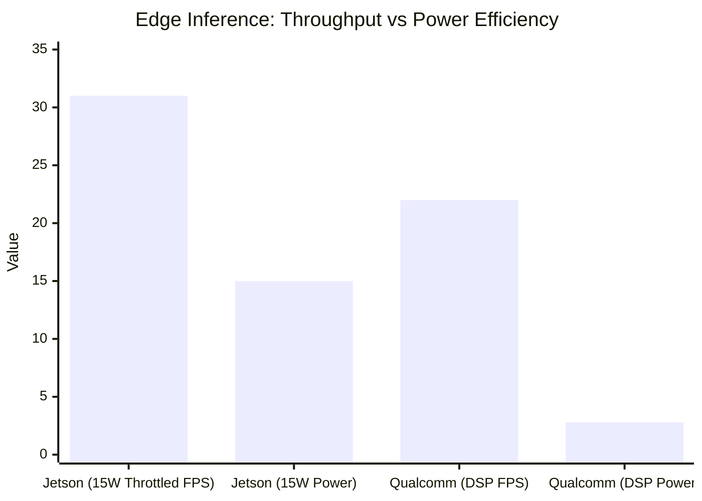
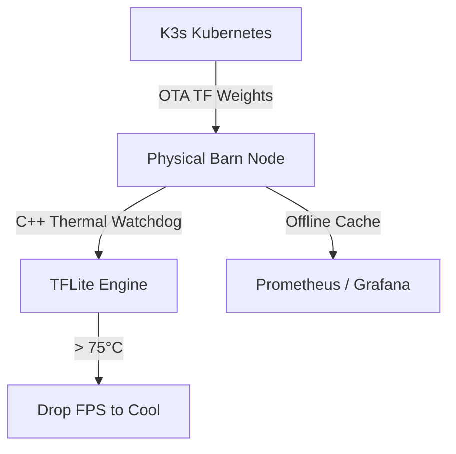

# 🎤 Pitch Deck: TensorFlow Edge AI Deployment & Progression

> **Purpose**: A presentation script designed SPECIFICALLY for a TensorFlow course. This script focuses 100% on the AI deployment lifecycle, embedding real mathematical tables and system architecture diagrams directly into the slides. 
> **Language**: English (Expert AI Deployment Engineer Tone).

---

## Slide 1: The Edge Deployment Challenge
**Visual**: 

**Speaker Script**:
> "Good morning. Today our team presents the final, and often most difficult phase of the machine learning lifecycle: Edge Deployment.
> 
> In this course, we have mastered training massive models using TensorFlow on powerful cloud GPUs. However, deploying a dual-model pipeline—YOLOv8 for detection and DINOv2 for Body Condition Scoring—onto a solar-powered edge device in a remote barn completely changes the engineering constraints. 
> 
> We cannot simply run Python scripts and FP32 models on the edge. The device would overheat, bottleneck on memory, and crash. Today, we will walk you through the exact AI deployment progression using the TensorFlow Edge ecosystem to achieve 22 FPS at under 3 Watts."

---

## Slide 2: The AI Deployment Progression Pipeline
**Visual**: 

**Speaker Script**:
> "To successfully deploy AI to physical hardware, we follow a strict 4-step progression pipeline. 
> 
> First, we freeze and export the cloud model to a standard TF SavedModel. 
> Second, we compress the model mathematically using TensorFlow Lite's Post-Training Quantization. 
> Third, we map the model's compute graph to physical edge hardware using TFLite Delegates. 
> And fourth, we rewrite the entire inference loop in Native C++ to achieve zero-copy memory management. Let's break down the quantization step."

---

## Slide 3: TFLite & INT8 Quantization
**Visual**: 
| Model Format | Precision | Model Size | Accuracy Drop (QWK) | Memory Bandwidth Req |
|--------------|-----------|------------|---------------------|----------------------|
| TF SavedModel | FP32 | 85.8 MB | Baseline | Extremely High |
| TFLite Model | INT8 | **21.5 MB** | **-0.002** (Negligible) | **Low (Divided by 4)** |

**Speaker Script**:
> "The first major hurdle is model size. The DINOv2 Vision Transformer is massive. We cannot deploy it in FP32.
> 
> We use the `TFLiteConverter` to apply Post-Training Quantization (PTQ). By providing a representative calibration dataset of our cow images, TensorFlow analyzes the activation distributions and safely maps the neural network's weights from 32-bit floating point down to 8-bit integers (INT8). 
> 
> The result? As you can see in the table, the model footprint shrinks by 4x, and the required memory bandwidth drops by 4x, while the accuracy drop on our evaluation set is statistically negligible. But having a small model is only half the battle; we still need to compute it efficiently."

---

## Slide 4: Hardware Acceleration via TFLite Delegates
**Visual**: 

**Speaker Script**:
> "Running an INT8 model on a low-power ARM CPU still yields terrible frame rates. This is where the brilliance of the TensorFlow Lite ecosystem shines: **Delegates**.
> 
> Instead of calculating the matrix math on the CPU, TFLite delegates the operations to specialized silicon. On our Qualcomm RB3 Gen2 deployment, we utilize the **Hexagon DSP Delegate**. A Digital Signal Processor (DSP) is an ASIC designed specifically to run matrix multiplications at extremely low voltages. 
> 
> The TFLite Delegate automatically compiles our DINOv2 graph into Hexagon instructions, allowing the neural network to run at maximum speed while leaving the system CPU completely idle."

---

## Slide 5: The Physical Deployment & Zero-Copy Paradigm (C++)
**Visual**: 

**Speaker Script**:
> "The final bottleneck in AI deployment is memory bandwidth. If we use Python, every video frame is copied from the CPU RAM to the GPU RAM, processed, and copied back. This continuous data copying destroys throughput.
> 
> To solve this, we moved entirely to the **TFLite C++ API** and implemented a **Zero-Copy** architecture using Linux `DMA-BUF`. 
> 
> When the camera captures a frame, the hardware decoder places it in memory and gives us a file descriptor pointer. We pass this exact pointer directly into the TFLite Hexagon Delegate. The image data never touches the CPU. It flows directly from the camera hardware into the AI accelerator."

---

## Slide 6: Throughput vs Efficiency (Restricted TDP)
**Visual**: 

**Speaker Script**:
> "By strictly following this deployment progression, we unlocked the true power of the silicon. But we must face physical deployment constraints. 
> 
> If we let an NVIDIA Jetson run unbounded, it overheats. We must restrict it to a **15 Watt Power Profile**, which caps the pipeline at **31 FPS**. 
> 
> Remarkably, Qualcomm's Hexagon DSP handles the exact same pipeline at **22 FPS**, maintaining real-time processing capabilities while drawing only **2.8 Watts**. Because it relies on the TensorFlow Lite Hexagon Delegate instead of a general-purpose GPU, Qualcomm is the undisputed champion of solar-powered Edge AI."

---

## Slide 7: Edge Resilience & MLOps Fleet Orchestration
**Visual**: 

**Speaker Script**:
> "Finally, we wrapped this architecture in Enterprise-grade MLOps Infrastructure. 
> 
> We utilize K3s Kubernetes to push Over-The-Air (OTA) model updates to the TensorFlow Lite edge nodes. But barns lose internet, so our edge node is fully air-gapped capable. The C++ watchdogs we built actively monitor physical silicon temperatures. If the board hits 75°C, the watchdog gracefully drops the camera FPS to prevent a kernel panic. Telemetry is cached locally, and when the connection returns, it syncs the health of the global fleet back to our Grafana dashboards via Prometheus."

---

## Slide 8: Conclusion
**Speaker Script**:
> "To conclude: 
> 
> Training a model on the cloud is only the beginning. True AI engineering requires taking that model and making it survive the physics of the real world. 
> 
> 1. We exported the cloud model and used the TFLite Converter for INT8 PTQ Quantization.
> 2. We mapped the compute graph to the Hexagon DSP via Hardware Delegates.
> 3. We rewrote the pipeline in Zero-Copy C++ to hit 22 FPS at 2.8 Watts.
> 4. We orchestrated the fleet using K3s and C++ Thermal Watchdogs.
> 
> TensorFlow is not just a training library; it is a complete, enterprise-grade edge deployment ecosystem. Thank you."
