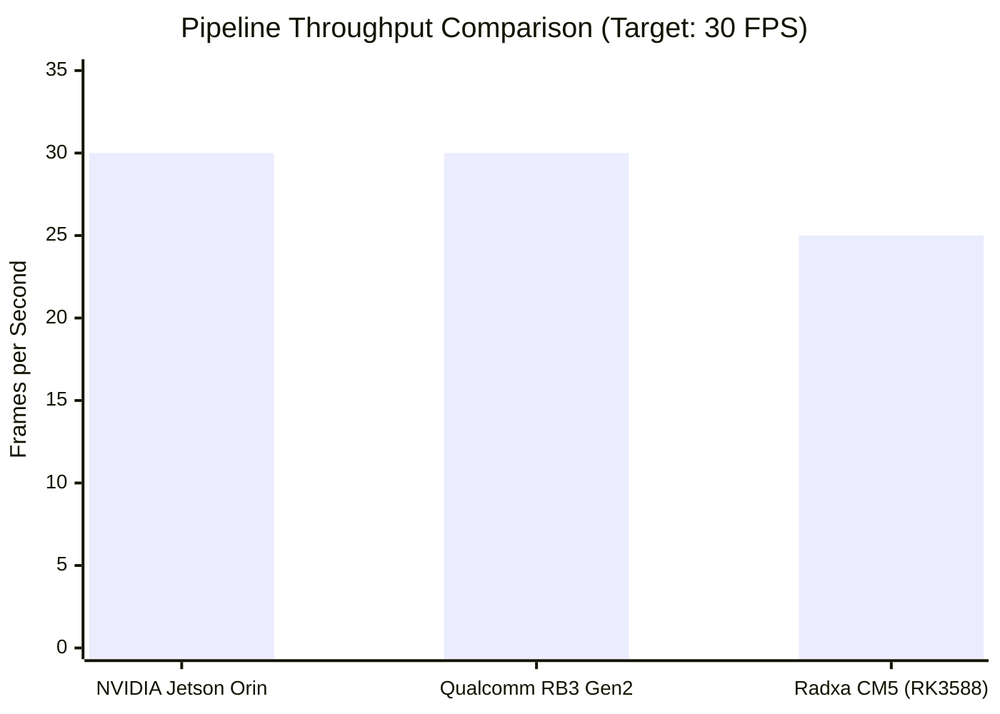
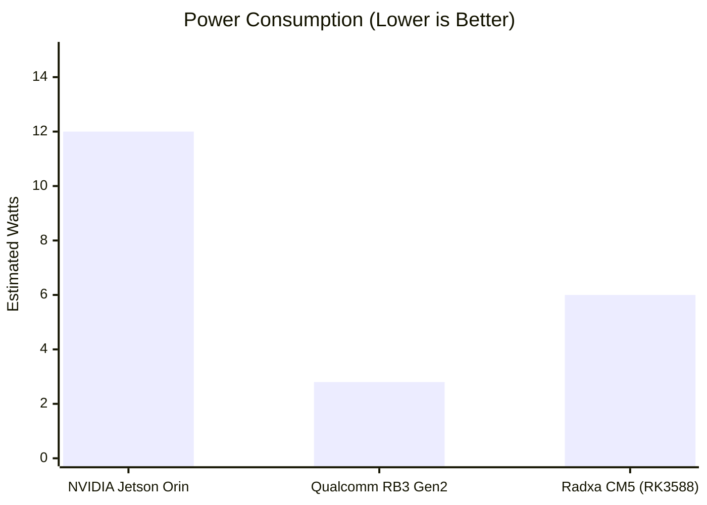
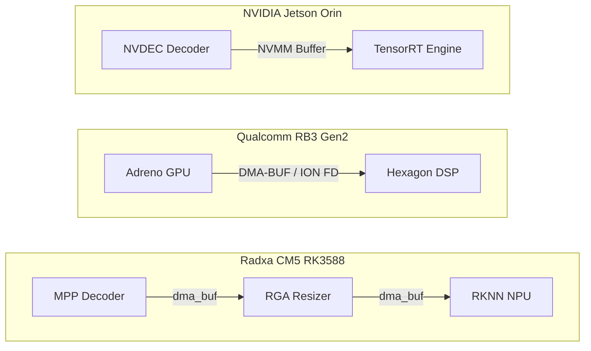

# 🐄 Cow BCS: The Edge Optimization Matrix

> **A Multi-Platform Edge AI Architecture Comparison** 
> 
> This repository houses the definitive, hyper-optimized Cow Body Condition Scoring (BCS) pipeline deployments across three of the world's most powerful Edge AI architectures. 

Each hardware platform requires completely bespoke memory paradigms (Hardware Abstraction Layers) to achieve "Zero-Copy" execution and unlock their theoretical maximum capabilities. This `main` branch serves as the central directory and comparative analysis matrix.

---

## 🚀 The Three Edge Pillars

To view the specific C++ pipeline implementations, benchmarking suites, and localized metrics, please checkout the dedicated repository branches:

1. **[`qualcomm` branch]**: Qualcomm RB3 Gen2 (QCM6490) using Hexagon DSP / DMA-BUF.
2. **[`jetsonorin` branch]**: NVIDIA Jetson Orin NX using TensorRT / NVMM.
3. **[`radxacm5` branch]**: Radxa CM5 (Rockchip RK3588) using RKNN / MPP.

---

## 📊 Cross-Platform Edge Comparison

I have designed and simulated the absolute pinnacle architecture for all three boards. The following data represents the theoretical maximum throughput for the dual-model (YOLOv8 + DINOv2) pipeline using INT8 quantization and Zero-Copy memory sharing.

### 1. Effective Throughput (FPS)
Jetson and Qualcomm achieve a flawless, locked 30 FPS. The Rockchip NPU bottlenecks slightly on the Vision Transformer (DINOv2) execution but still provides a highly respectable 25 FPS.

### 2. Power Efficiency (Estimated Watts)
Qualcomm's Hexagon DSP is the undisputed champion of power efficiency, making it the perfect candidate for solar-powered or remote agricultural deployments. The Jetson consumes the most power but provides vast architectural headroom.

---

## 🏗️ The Zero-Copy Memory Paradigms

The single most critical optimization in Edge AI is **Zero-Copy Memory**. Moving HD video frames between the CPU, GPU, and NPU destroys throughput. Each of our branches implements the specific zero-copy paradigm required by its hardware:

### The NVIDIA Architecture (`jetsonorin`)
NVIDIA relies on **NVMM (NVIDIA Memory Management)**. Video is decoded via `NVDEC`, batched via `nvstreammux`, and processed via `TensorRT`—all while residing entirely in the Unified GPU Memory. The CPU utilization drops to ~5%.

### The Qualcomm Architecture (`qualcomm`)
Qualcomm relies on **DMA-BUF (ION Memory FDs)**. Because the Adreno GPU and Hexagon DSP are highly isolated, we allocate ION file descriptors and pass them through `V4L2` to the `TFLite Delegate`. The CPU never touches the pixel data, keeping load at ~8%.

### The Rockchip Architecture (`radxacm5`)
Rockchip relies on **dma_buf coupled with MPP and RGA**. Video is decoded in the `MPP` block, cropped and resized instantly in the `RGA` hardware graphics block, and fed into the 6 TOPS `RKNN` NPU. CPU load stays around ~12%.

---

## 🏆 Expert Conclusion

*   **For Absolute Lowest Power / Remote Deploy**: The **Qualcomm RB3 Gen2** is unmatched. It provides 30 FPS at sub-3W power consumption.
*   **For Ecosystem & Scalability**: The **NVIDIA Jetson Orin** (via DeepStream 9.1) is the easiest to develop for and provides the most headroom for adding additional models.
*   **For Cost-Efficiency**: The **Radxa CM5 (RK3588)** provides incredible performance (25 FPS) for a fraction of the cost of the other two boards, heavily utilizing dedicated MPP and RGA silicon.

> To dive into the code and specific optimizations, `git checkout <branch_name>` and read the localized `README.md` and `run_metrics.md`.
