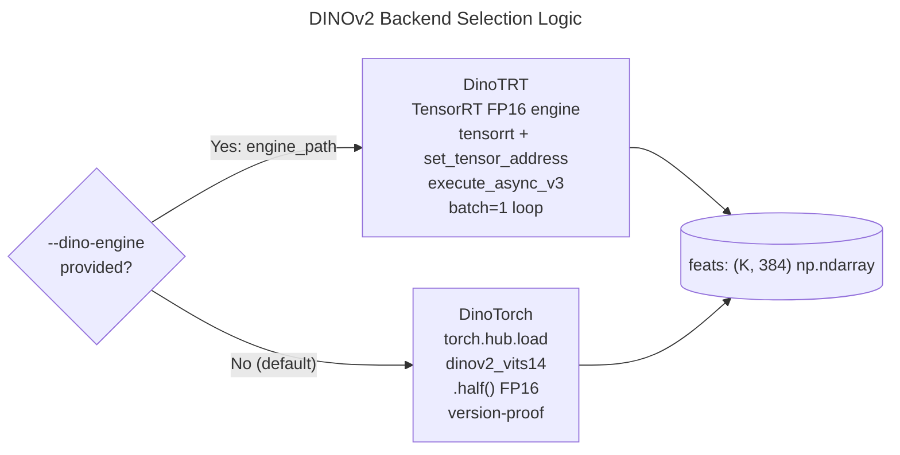
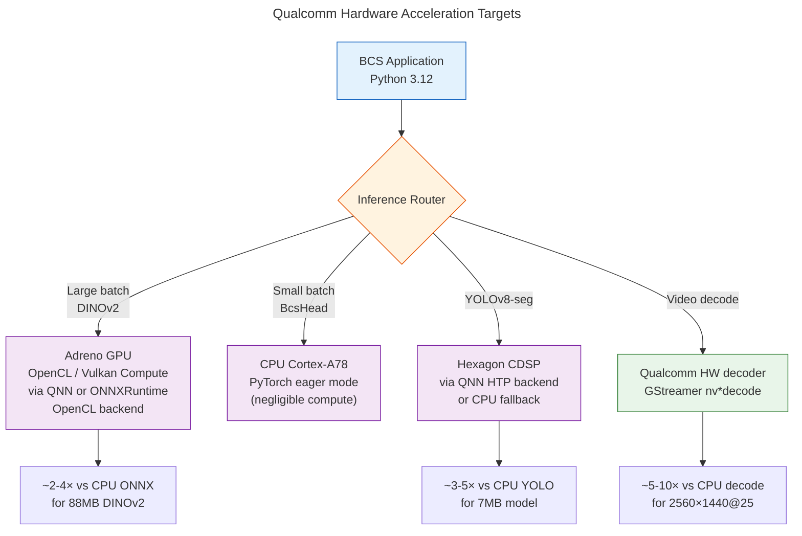

# BCS Pipeline Architecture Diagram

```mermaid
---
title: BCS (Body Condition Scoring) Inference Pipeline — End-to-End Data Flow
---
flowchart TD
    %% INPUT
    IN(["📹 Input Video\n.mp4 / H.264"])
    
    %% PREPROCESSING
    subgraph PREPROC ["Preprocessing Layer"]
        CAP[cv2.VideoCapture\nframe extraction] --> RESIZE[Resize frame\nto native resolution]
    end

    %% DETECTION
    subgraph DETECT ["Detection & Segmentation — YOLOv8n-seg"]
        YOLO[YOLOv8n-seg\nCOCO-pretrained] --> CLASS[Filter class=19\n'cow']
        YOLO --> SEG[Segmentation mask\ngeneration]
        CLASS --> BOXES[Bounding boxes\nxyxy format]
        SEG --> MASKS[Per-instance\nbinary masks]
    end

    %% CROP EXTRACTION
    subgraph CROP ["Crop & Preprocess"]
        direction TB
        C1["x1,y1 = max(0,box)\ncrop from frame"] --> C2["Apply mask\nbackground zeroing"]
        C2 --> C3["cv2.resize → 224×224\nINTER_AREA"]
        C3 --> C4["BGR→RGB / 255.0\nImageNet normalize\nmean=[0.485,0.456,0.406]\nstd=[0.229,0.224,0.225]"]
        C4 --> C5["HWC→CHW\ntorch.tensor (3,224,224)"]
    end

    %% FEATURE EXTRACTION
    subgraph FEATURE ["Feature Extraction — DINOv2 ViT-S/14"]
        direction TB
        DINO[["DINOv2 ViT-S/14\n⚡ ONNX Runtime\nor\n🐍 PyTorch FP16"]] --> CLS_TOKEN["CLS token\n384-dim embedding"]
    end

    %% CLASSIFICATION
    subgraph CLASSIF ["Classification — BcsHead"]
        HEAD[BcsHead\nLayerNorm→Linear(384→128)→GELU→Dropout\nLayerNorm→Linear(128→128)→GELU→Dropout\nLinear(128→3)] --> SOFTMAX[Softmax\n3-class scoring]
        SOFTMAX --> LABEL["argmax → class\nthin / ideal / fat"]
        SOFTMAX --> CONF["max prob →\nconfidence score"]
    end

    %% OVERLAY & OUTPUT
    subgraph OVERLAY ["Visualization & Output"]
        direction TB
        O1["Draw rectangle\ncolor-coded by band\n🔵 thin / 🟢 ideal / 🔴 fat"] --> O2["Label: BCS: {class} {conf:.2f}"]
        O2 --> O3["FPS counter + \n'OOD: screening only'\nwarning overlay"]
        O3 --> O4["cv2.VideoWriter\n.mp4 output"]
    end

    %% PERFORMANCE MONITOR
    subgraph PERF ["Performance Tracking"]
        P1["t_yolo = cumul. YOLO time\nper frame"]
        P2["t_dino = cumul. DINO time\nper frame (all cows)"]
        P3["FPS = n / t_all"]
    end

    %% DATA FLOW CONNECTIONS
    IN --> CAP
    CAP --> YOLO
    BOXES --> C1
    MASKS --> C2
    C5 --> DINO
    CLS_TOKEN --> HEAD
    LABEL --> O1
    CONF --> O1
    O3 --> O4
    O4 --> OUT(["📁 Annotated video\n.mp4 / .avi"])

    %% PERF MONITORING
    YOLO -.-> P1
    DINO -.-> P2
    P1 -.-> P3
    P2 -.-> P3

    %% STYLING
    classDef gpu fill:#e1f5fe,stroke:#0288d1,stroke-width:2px
    classDef cpu fill:#f3e5f5,stroke:#7b1fa2,stroke-width:2px
    classDef io fill:#e8f5e9,stroke:#388e3c,stroke-width:2px
    classDef warn fill:#fff3e0,stroke:#f57c00,stroke-width:2px
    class IN,OUT io
    class YOLO,SEG,CLASS gpu
    class DINO,CLS_TOKEN gpu
    class HEAD,SOFTMAX,LABEL,CONF cpu
    class O1,O2,O3,O4 cpu
    class CAP,RESIZE,C1,C2,C3,C4,C5 cpu
```

```mermaid
---
title: Project Directory Structure
---
graph TD
    ROOT["📁 COWdeploy/"] --> DEPLOY_JETSON["📄 DEPLOY_JETSON.md\nOriginal Jetson deploy guide"]
    ROOT --> JETSON_SCRIPT["📄 jetson_bcs_demo.py\nOriginal Jetson inference"]
    ROOT --> CONFIG["📄 production_config.json\nModel config (classes, norm)"]
    ROOT --> YOLO["📄 yolov8n-seg.pt\nYOLOv8 seg weights (7MB)"]
    ROOT --> HEAD["📄 production_head_vits.pt\nBcsHead weights (273KB)"]
    ROOT --> DINOV2["📄 dinov2_vits14.onnx\nDINOv2 ONNX model (88MB)"]
    ROOT --> VIDEO["📄 sample_cow_video.mp4\nCow video sample (260MB)"]
    ROOT --> WHEELS["📁 wheels/\nJetson-specific .whl files"]
    ROOT --> REPORTS["📁 reports/\nAnalysis & documentation"]
    ROOT --> DIAGRAMS["📁 diagrams/\nArchitecture visuals"]
    ROOT --> SCRIPTS["📁 scripts/\nQualcomm-adapted scripts"]
    ROOT --> QUALCOMM["📁 qualcomm_adaptation/\nQualcomm-specific code"]
    ROOT --> PROFILING["📁 profiling/\nBenchmark & profiling"]
    ROOT --> MODELS["📁 models/\nConverted models (QNN)"]
```






